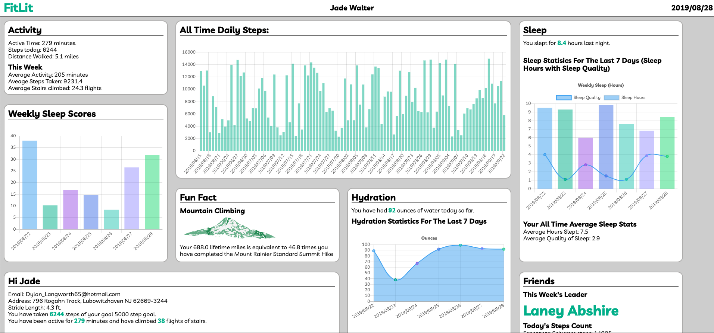
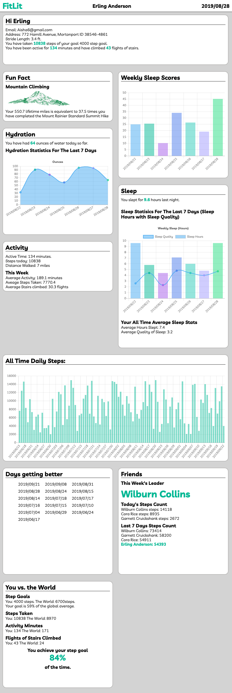
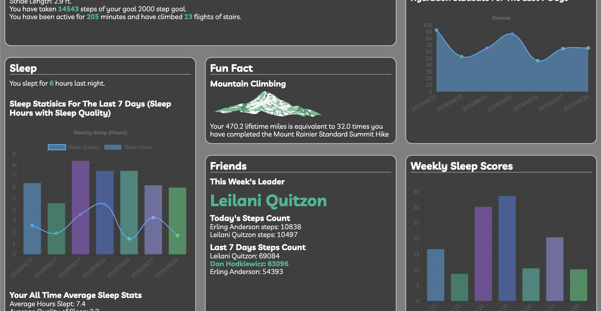

# FitLit

## [Live Site](https://peeratmac.github.io/fitlit/src/index.html)

### [Kirk Veitch](https://github.com/kveitch) and [Peerat Sukcharoenyingyong](https://github.com/peeratmac)

## Working Product

## Languages and Libraries

- JavaScript
- jQuery
- Chart.js
- Packery
- Draggabilly
- HTML
- CSS

## Unit Testing

- Mocha
- Chai

## Goals and Objectives

- Follow the specification below to make a working application
- Implement ES6 classes that communicate to each other as needed
- Write modular, reusable code that follows SRP (Single Responsibility Principle)
- Implement a robust testing suite using TDD
- Use object and array prototype methods to perform data manipulation
- Display information on the page while maintaining ability to test class properties and methods
- Create a data dashboard that is easy to use and displays information in a clear way

## Screenshots

## Future Functionalities

- Menu systen in the upper right courner giving user access to more options
- Dark Mode should be nested in this menu
- Persist user section placements
- Allow user to select an alternate color scheme for the app
- Allow user to view data from any selected date
- Allow user selection
- Ability to add new users
